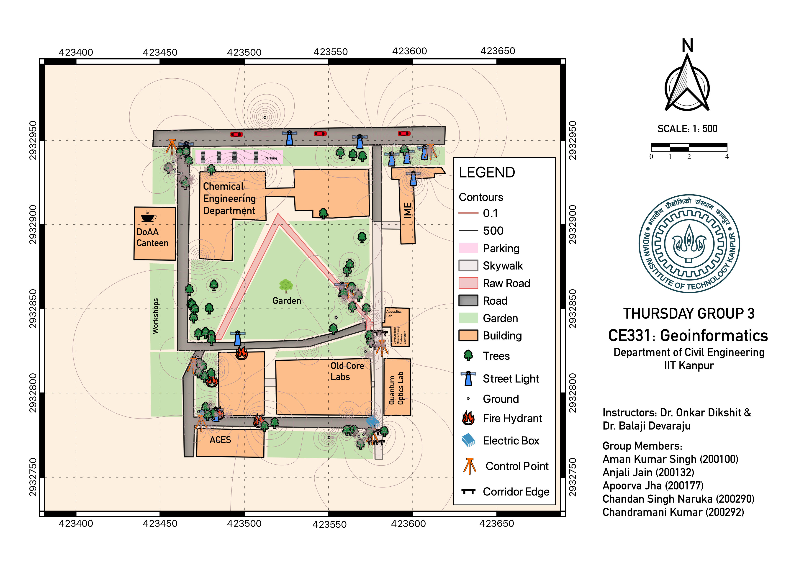

# CE331 Map Project

### THURSDAY GROUP 3

As part of the lab project, we mapped the area around the IME Building and the DOAA canteen. During the six-week period, the group established control points, measured internal angles for the closed traverse, determined elevation for the established control points, used GNSS to determine global coordinates of the control points, and mapped features of the area using the QGIS software to create a full-fledged map of the entire area allotted.

#### Map: <a href="Map.pdf" rel="TA201-Map.pdf">[PDF]</a>

#### Project Report: <a href="Project Report.pdf" rel="TA201-Map.pdf">[PDF]</a>

<b>Mentor:</b> Prof. Onkar Dikshit & Balaji Devaraju, Dept. of Civil Engineering, IIT Kanpur

<b>Tutor:</b> Mr. Ibaad Anwar & Mr. Ashish Katiyar, Dept. of Civil Engineering, IIT Kanpur

<b> Group Members:</b>
| Roll No | Name | Email |
| -- | -- | -- |
| 200100 | Aman Kumar Singh | amanks20@iitk.ac.in |
| 200132 | Anjali Jain | anjali20@iitk.ac.in |
| 200177 | Apoorva Jha | apoorvaj20@iitk.ac.in |
| 200290 | Chandan Singh Naruka | chandansn20@iitk.ac.in |
| 200292 | Chandramani Kumar | kchandra20@iitk.ac.in |

